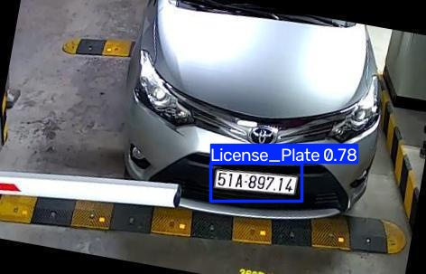

# 🚘 License Plate Recognition using YOLO11 + PaddleOCR

A Computer Vision project for **License Plate Detection and Recognition** using YOLO11 and PaddleOCR.

The system detects license plates from images and videos, extracts the plate region, preprocesses it, recognizes the plate text using OCR, and tracks detected plates across video frames.

---

## 🚀 Project Pipeline

```text
Input Image / Video
        ↓
YOLO11 License Plate Detection
        ↓
License Plate Crop
        ↓
Padding + Deskew
        ↓
Image Preprocessing
        ↓
PaddleOCR
        ↓
OCR Result Selection
        ↓
License Plate Tracking
        ↓
Annotated Output Video
```

---

## 🧠 Technologies

* Python
* YOLO11
* Ultralytics
* PaddleOCR
* OpenCV
* NumPy
* Matplotlib
* Roboflow
* Google Colab

---

## ✨ Features

### License Plate Detection

YOLO11 is trained to detect vehicle license plates from images and video frames.

### Image Preprocessing

The detected plate is processed using:

* Bounding box padding
* Deskewing
* Image upscaling
* Grayscale conversion
* CLAHE
* Unsharp masking

Multiple preprocessing variants are tested before OCR.

### OCR

PaddleOCR is used to recognize the text inside detected license plates.

The system compares OCR results from different preprocessing variants and keeps the result with the highest confidence.

### Video Tracking

Detected license plates are assigned tracking IDs.

IoU (Intersection over Union) is used to associate detections between consecutive frames.

Each tracked plate keeps an OCR history to improve the final recognized text.

---

## 🎥 Video Processing

The system processes video frame-by-frame:

```text
Video
 ↓
YOLO11
 ↓
License Plate Detection
 ↓
IoU Tracking
 ↓
Plate Crop
 ↓
Preprocessing
 ↓
PaddleOCR
 ↓
OCR History
 ↓
Final Plate Text
```

The output video contains:

* License plate bounding boxes
* Tracking IDs
* Recognized plate text
* OCR confidence

---

## 📸 Results

### License Plate Detection

<p align="center">
  
  
</p>

<p align="center">
  
  
</p>

---

## 🎥 Demo

[▶️ Watch the License Plate Recognition Demo](license_plate_demo.mp4)

---

## 🏋️ Model Training

The YOLO11 model was trained using a license plate dataset from Roboflow.

### Training Code

```python
from ultralytics import YOLO

model = YOLO("yolo11n.pt")

model.train(
    data="/content/License-Plate-Recognition-1/data.yaml",
    epochs=50,
    imgsz=640,
    batch=16
)
```

---

## 🔍 Image Inference

Example:

```python
results = model.predict(
    source=image_path,
    conf=0.25,
    imgsz=1280
)
```

---

## 📊 Model Evaluation

The trained model was evaluated using:

* mAP50
* mAP50-95
* Precision
* Recall

---

## 📁 Project Files

```text
license-plate-recognition-yolo-ocr/
│
├── README.md
├── license_plate_ocr.ipynb
├── requirements.txt
├── .gitignore
│
├── download.png
├── download (3).png
├── download (4).png
├── download (5).png
│
└── license_plate_demo.mp4
```

---

## 🔮 Future Improvements

* Improve OCR accuracy for low-resolution plates
* Add stronger object tracking
* Improve perspective correction
* Support Arabic license plates
* Real-time camera detection
* Store recognized plates in a database
* Build a web interface for real-time detection

---

## 👨‍💻 Author

**Rewan Srour**

Computer Engineering Student
AI & Computer Vision Enthusiast
